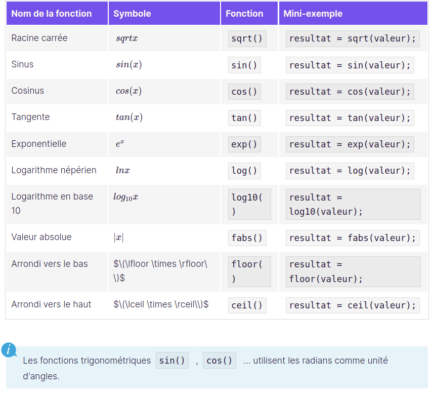

# C++ programing course
## 1. La bibliothèque  iostream

1. **`#include <iostream>;`** :

Cette ligne inclut la bibliothèque standard d'entrée/sortie en C++. Elle permet d'utiliser des fonctionnalités comme std::cout pour afficher du texte à l'écran ou std::cin pour lire des entrées utilisateur.

2. **`using namespace std;`** :

Cette ligne permet d'éviter de devoir préfixer les noms des éléments du namespace **_std_ (standard)** avec `std::`. Par exemple, au lieu d'écrire `std::cout`, vous pouvez simplement écrire cout.
Cependant, cette pratique est parfois déconseillée dans les grands projets, car elle peut provoquer des conflits de noms si plusieurs namespaces sont utilisés.

Donc, la deuxième ligne simplifie l'écriture du code, mais elle doit être utilisée avec précaution.

3. **`cout`** commande l'affichage d'un message à l'écran.
4. **`endl`** crée un retour à la ligne dans la console.

Eg: `cout << "Hello world!" << endl;`

## 2. Déclarez une variable

Pour déclarer une variable, il faut écrire un code qui indique, dans l'ordre :

1. Son type.  
2. Son nom.  
3. Et la valeur qu'elle contient :

_`TYPE NOM(VALEUR);`_

## 3. Utilisez les références
La référence d'une variable, c'est un peu comme si on donnait un surnom à une variable en plus de son nom normal. On parle parfois d'alias, mais le mot correct en C++ est référence.  
On a une seule case mémoire, mais deux étiquettes qui lui sont accrochées.
Au niveau du code, on utilise une esperluette **( & )** pour déclarer une référence sur une variable  
Eg: 
```cpp
int ageUtilisateur(16);  //Déclaration d'une variable.

int& maVariable(ageUtilisateur); //Déclaration d'une référence nommée maVariable qui est accrochée à la variable ageUtilisateur
```
**La référence doit impérativement être du même type que la variable à laquelle elle est accrochée ! Un int&  ne peut faire référence qu'à un int  , de même qu'un string& ne peut être associé qu'à une variable de type string.  
Une fois qu'elle a été déclarée, on peut manipuler la référence comme si on manipulait la variable elle-même. Il n'y a aucune différence entre les deux.**
## 4. Stockez les informations données par l'utilisateur
C++ utilise beaucoup de mots tirés de l'anglais. C'est le cas des flux sortant et entrant :  
`cout`  (qui se prononce "c-out "), associé aux chevrons `<<`  , permet de faire sortir les données du programme.  
`cin` ("c-in"), associé aux chevrons `>>`  , permet de faire entrer des informations dans le programme.  
Ayant ce code :  
```cpp
#include <iostream>
#include <string>
using namespace std;

int main()
{
    cout << "Quel est votre prenom ?" << endl;
    string nomUtilisateur("Sans nom"); //On crée une case mémoire pour contenir une chaine de caractères
    cin >> nomUtilisateur; //On remplit cette case avec ce qu'écrit l'utilisateur

    cout << "Combien vaut pi ?" << endl;
    double piUtilisateur(-1.); //On crée une case mémoire pour stocker un nombre réel
    cin >> piUtilisateur; //Et on remplit cette case avec ce qu'écrit l'utilisateur
     
    cout << "Vous vous appelez " << nomUtilisateur << " et vous pensez que pi vaut " << piUtilisateur << "." << endl;

    return 0;
}
```
Avec cette execution : 
 ```
Quel est votre prenom ?
Albert Einstein
Combien vaut pi ?
Vous vous appelez Albert et vous pensez que pi vaut 0.
```

On remarque que 'ordinateur n'a rien demandé pour pi, et le nom de famille a disparu !

C'est un problème d'espaces.

**Quand on appuie sur la touche Entrée  , l'ordinateur copie ce qui a été écrit par l'utilisateur dans la case mémoire. Mais il s'arrête au premier espace ou retour à la ligne.**

Quand il s'agit d'un nombre, cela ne pose pas de problème puisqu'il n'y a pas d'espace dans les nombres ; mais pour une string  , il peut très bien y avoir un espace dans une chaîne de caractères… L'ordinateur coupe donc au mauvais endroit : après le premier mot. Et comme il n'est pas très malin, il croit que le nom de famille correspond à la valeur de pi…

Il faudrait récupérer toute la ligne, pas juste le premier mot. Et si je vous en parle, c'est qu'il y a une solution pour le faire : la fonction **`getline()`**  . 

Il faut remplacer cin `>> nomUtilisateur;` par `getline(cin, nomUtilisateur)` 

**La fonction `getline()` lit une ligne complète de texte et la stocke  seulement dans une variable de type `std::string`. C'est pourquoi**

**Si l'on utilise d'abord `cin >>` puis `getline()`  , par exemple pour demander la valeur de pi avant de demander le nom, le code ne fonctionne pas. L'ordinateur ne demande pas son nom à l'utilisateur, et affiche n'importe quoi.
Pour pallier ce problème, il faut ajouter la ligne `cin.ignore()`  après l'utilisation des chevrons**  
Le `getline()` est utilisé pour la variable de type **string** qui va prendre la valeur qui contient des espaces.
## 5. Utilisez des fonctions mathématiques
Pour utiliser une fonction mathématique, on écrit le nom de la fonction suivi, entre parenthèses, de la valeur à calculer. On utilise alors l'affectation pour stocker le résultat dans une variable :

**resultat = fonction(valeur);**
1. **La fonction racine carrée**  
`resultat = sqrt(valeur);`
2. **La fonction puissance**  
`resultat = pow(valeur, b);` ceci est equivalent à  **valeur^b**
1. **La fonction racine carrée**  

